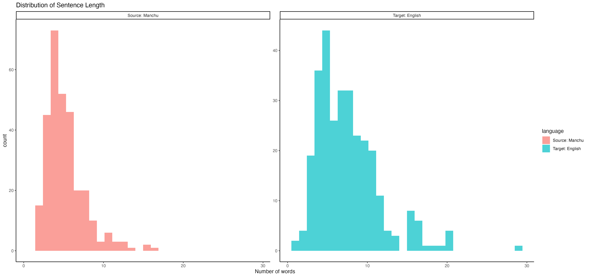
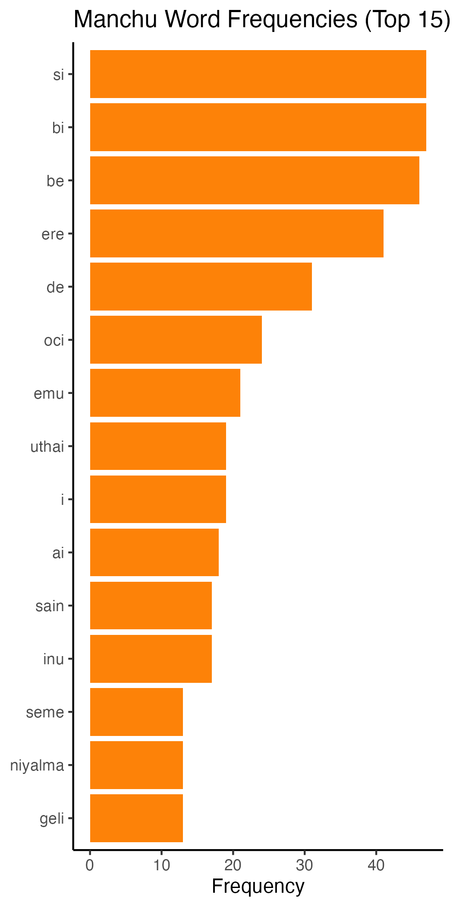
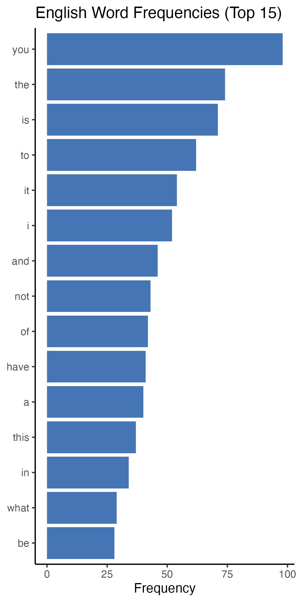
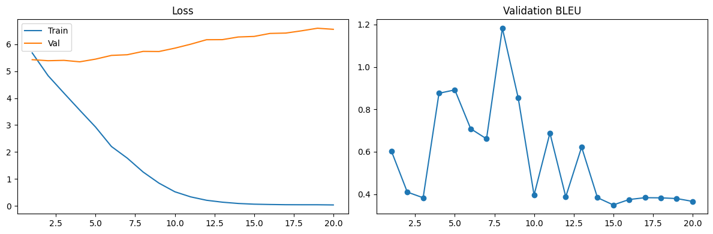
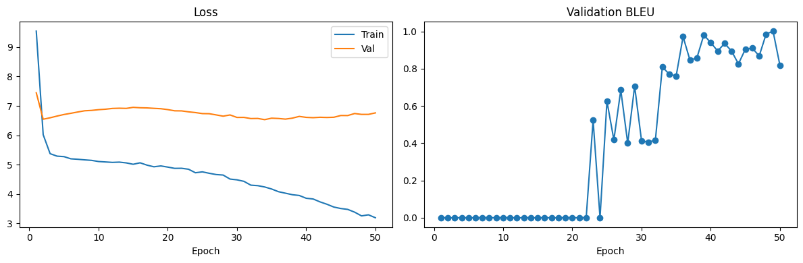
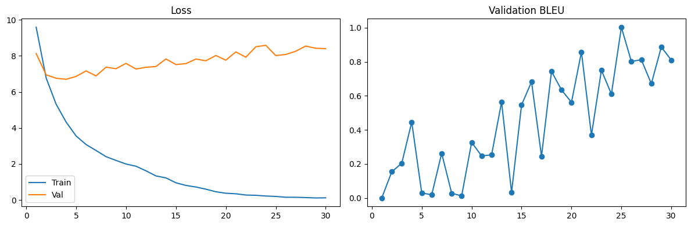

## Introduction

This project is an attempt to try out a Neural Machine Translation approach for the challenging task of Manchu-English translation.

- Keywords: Neural Machine Translation, Data Curation, In-Context Machine Translation, Endangered Language

::: {.callout-note title='The Language Manchu' collapse='true'}

#### Our Goal and the challenges along the way


1. Language in danger: Manchu is often treated as Latin, mainly learned to read historical documents, but unlike Latin, it still has a spoken tradition today. In the **Qapqal Xibe Autonomous County** in Xinjiang, where its use is part of deliberate preservation efforts, taken by the Xibe people in the name of Xibe (Sibe) language
2. Digitization challenges: As some might have observed that the Manchu writing system is very far from that of English or the most common writing system in the world. First, the direction, in **columns** and from left to right, similar to Arabic rotated 90 degrees counter-clockwise. Second, Manchu script (alphabets) can be described as **IMFI** script whih letters can take on more than four different shapes depending on where they appear in the word or in isolation. This complicated the picture for OCR, due to the extra work on letter segmentation.
3. Transliteration
4. Traslation


:::

## Literature Review

In this section, I want to briefly talk about the three papers that introduced me to the task of Manchu Machine Translation and I helped shape my methods and approaches in this project. These studies, in their distinctive ways engaged the Manchu Language revitalization effort in the broader dialogue of Neural Machine Translation in low-resource settings.

##### Seo et al., *“Mergen: The First Manchu-Korean Machine Translation Model Trained on Augmented Data.”*^[@seoMergenFirstManchuKorean2024]

This paper introduces us the challenges of developing the typically data-driven Nueral Machine Translation models for Manchu, which suffers from scarcity (an extreme one) of parallel data --not only just in their case of Manchu-Korean translation, but generally. They thus come up with an innovative data augmentation strategy based on **word replacement**, where lexical similarity is determined using GloVe embeddings of dictionary items. By augmenting the parallel corpus in this way, they witness a significant improvement of the BLEU score of their seq2seq model, from 0 to 38 as number of sentence pairs grows from 20K to 179K.

##### Lee et al., *“ManNER & ManPOS: Pioneering NLP for Endangered Manchu Language.”*^[@leeManNERManPOSPioneering2024]

This study, continuing their line of work, this team of researcher with their data augmentation technique further contributed by training from scratch the Manchu Langauge Model **manchuBERT** and releasing the model on Hugging Face. They then use the manchuBERT as the starting point for developing NER and POS tagging for Manchu, the strong performance of these downstream NLP modeling in turn provides evidence that manchuBERT langauge model indeed learned to be a robust encoder for Manchu.

#### Pei et al., *Understanding In-Context Machine Translation for Low-Resource Languages: A Case Study on Manchu*^[@pei-etal-2025-understanding]

The third paper also devotes to the discussion of the prospect of low-resource machine translation, but approach the problem from a different angle. Rather than focusing on model architectural modifications or data augmentation, they get themselves around to think about how **human-curated linguistic knowledge**, such as dictionaries and grammar books can help in this picture. Specifically, how these linguistic resources can be instilled to pre-trained LLM and leverage their in-context learning (**ICL**) capability to machine translation of languages they are not trained on. Through experiment designs they systematically examine the effect of different linguistic information, and arrive at the conclusion that, dictionaries that comprehensively covers lexical meanings, suffix explanations, and morpheme collocation info can effectively improve translation quality, the same can parallel examples.


## Data

### Data Collection

The data used in this project is one small but carefully examined Manchu-English parallel dataset. I chose the renowned novel ***The Dream of the Red Chamber*** written in classical Chinese by Cao Xueqin (published in the 1790s Qing China)^[the novel was written in "Written Vernacular Chinese", but still not that as explicit as modern Chinese], in specific, the novel's Manchu translation(@CaoXueQinHongLouMengXiBoWen1993) and English translation (@caoHungLouMeng2006) With the hope that translators of this canonical literature had stronger emphasis on fidelity to the original text thus expecting it to be relatively easier for me to find sentence-level alignment that would help me a lot in building my language pairs

Here, I present some key distributions of my dataset:

Sentence Length:

- Manchu: 5.38 words per sentence in average
- English: 7,73 words per sentence in average



Vocabulary Size:

- Manchu: 700 distinct words
- English: 669 distinct words

:::: {.columns}
::: {.column}



:::
::: {.column}



:::
::::

#### Data Split

I reserved 12.5% for validation (37 rows), as for the other 38 rows for testing, which remains 225 rows for training. Given the very limited size of our data, and the often large size of training parameters in our neural models, regularization and monitoring validation loss are both very crucial concerns in the training process.^[a better and definitely doable robustness test is to implement k-fold cross validation so as to eliminate the effect of data splitting for small sample]

### Data Preprocessing

#### Text cleaning and normalization

For simplicity, I removed all the punctuations, and all sentences are converted to lowercase.

::: {.callout-note title='The issue of Transliteration Alignment'}

One challenge I encountered in the data preparation phase is around the issue of transliteration, and I found it worth recording, so I would like to share it here. The transliteration system that I was using initially for my self-curated dataset is the **Möllendorff-Norman** system, because this is the one our Manchu professor taught, and also one of the most used system. 

Later in an attempt of harvesting from the pre-trained manchuBERT, I found in the *Mergen (2024)* paper statements that they use **Abkai transliteration**, so I converted my dataset into Abkai only to find out that they not quite entirely adopt this system. To clarify this, and because the datasets they disclosed in the github repository are the test ones, thus I did a small experiment with the manchuBERT as masked language model. After inputting some sentences with mask tokens, the outputs of manchuBERT revealed that they actually use a hybrid system for transliteration, for example, the model represents the sixth Manchu vowel using `v` rather than the Norman `ū`; uses `x` instead of the Norman `š`, which seems to be aligning to the Abkai system. At the same time, it employs Norman `c` rather than the Abkai-preferred `q`.

Regarding to these observations, I re-romanized the Manchu side of my data to ensure the alignment of the one manchuBERT learnt. I think this transliteration alignment process that I underwent actually highlights a non-trivial challenge in obtaining and integrating online Manchu resources, when without a standardized transliteration system, languages that use non-Latin scripts are going to suffer, or will require additional attention in the data preprocessing stage.

:::

#### Tokenization

Different ways for tokenizations are implemented for my four MT attempts. I would like to provide a brief illustration in this section before we go into the models. 

In *Attempt 1*, tokenization was done by splitting our sentences by white spaces, thus, a word-level tokenization.^[with four additional tokens, <pad>, <bos>, <eos>, <unk>] As for *Attempt 2*, to correctly map to manchuBERT, I use the AutoTokenizer from Hugging Face transformer library to retrieve the tokenizer of our pre-trained model. And as stated in the paper, the tokenization they applied is **WordPiece**; in the English output part the bert-base-ubcased tokenizer was applied.^[with manually handling <eos> and <bos>]In *Attempt 3*, I continue to use the manchuBERT tokenizer for Manchu source sentences; the English counterpart uses the SentencePiece tokenization, which does the **subword** segmentation, and I have to additionally specify the tokenizer to translate into English. Finally, *Attempt 4*, the sentence was feed to google colab AI directly.


## Approaches

### *Attempt 1: 2 GRUs* -- Seq2seq Network  with Attention

This is the baseline model I go for, and I reference directly to the Pytorch tutorial for the implementation from scratch(@NLPScratchTranslation), and also because it has a similar structure to the descriptions in the Mergen paper(@seoMergenFirstManchuKorean2024)

Model Architecture:

  - The sequence-to-sequence model involves two RNNs, carried out as **Gated Recurrent Units**. Our first GRU did the encoder job, and the second GRU has a twist of the attention weights calculation in the decoding.^[the attention mechanism is the **additive Bahdanau attention**, one way of looking at this mechanism, in the context of neural machine translation, is that it helps in many ways to the ability to deal with word ordering of our languages, and order the varying lengths of the sentences.]

Hyperparameters:

  - Learning Rate = 0.001
  - Embedding size = 256
  - Hidden Size = 512
  - Dropout Rate = 0.2
  - Epochs = 20

### *Attempt 2: Frozen ManchuBERT + LSTM Decoder*

Model Designs:

  - My second attempt reflects the representation-level transfer learning, which I use the `Automodel` class from transformers library to load the **manchuBERT** model configuration from Hugging Face, and then I use the method `from_pretrained()` to acquire the model parameters. As provided in the documentation (@seoMergenFirstManchuKorean2024), manchuBERT is a language model trained on more than 5.2 M monolingual Manchu sentences^[195,611 monolingual Manchu sentences before data augmentation] And the embedding vector is of 768 length. With the help of manchuBERT our raw Manchu input can be transformed into rich and context-aware representation space, as an encoder I pair it with an LSTM decoder for our downstream translation task.

Hyperparameters:

  - Learning Rate = 2e-4
  - Embedding size = 256
  - Hidden Size = 512
  - Number of Layers = 2
  - Dropout Rate = 0.2
  - Epochs = 50

### *Attempt 3: manchuBERT & mBART*

Model Designs:

  - The new things introduce in our Attempt 3 is that we now pass our encodings to the **mBART**,^[One of the key contributions of the mBART model is that it is proven to be conducive to translation of even the languages unseen by the model to fluent English sentences] the pre-trained, **end-to-end** multilingual to English model there to help us getting from encoded Manchu to sensical English sentences.(@liuMultilingualDenoisingPretraining2020)

Hyperparameters:

  - Learning Rate = 3e-5
  - Epochs = 30

### *Attempt 4: Norman Dictionary + Google Colab AI* -- In-Context Machine Translation

Experiment Designs

  - Our last attempt was primarily inspired by the ICL Machine Translation paper^[@pei2025understandingincontextmachinetranslation] The linguistic resource explored is *The Comprehensive Manchu-English Dictionary* from Jerry Norman(@normanComprehensiveManchuEnglishDictionary2013) Step by step, I first parse the dictioanry into `item`-`meaning` pairs of 21K, and I retrieve the vocabularies from our source Manchu sentence and incorporate the dictionary info as part of the translation prompt
  - One more special account for Attempt 4 is that rather than directly encipher our source to eliminate the prior knowledge of our LLM, I introduce some controls to the experiment by speicify that the task is Manchu-to-English or not specifying the target language, or create a substitute such as "Anchum" language in the prompt.

Prompt example:

```{.r}

Please help me translate the following input sentence into English
For the translation task, you are given the word by word mapping
from the {source language} words to the {target language} words

        Please try your best to translate, it’s okay if
        your translation is bad. Do not refuse to try it.
        I won’t blame you.
        
IMPORTANT:
- Output the input sentence's English translation ONLY.

MINI: genitive of bi: my, of me
OKTO: drug, medicine; gunpowder; dye; poison
SINDE: dative/locative of si
AI: what? which?; hey!
DALJI: relation, bearing, connection

### TRANSLATION ###
Input: mini okto omire omirakvngge sinde ai dalji
English:
### END ###
```

```{.r}
Source: mini okto omire omirakvngge sinde ai dalji
What connection does my medicine to be consumed have to you?
```

## Results

### Evaluation Metrics

1. Automatic Evaluation: Bilingual Evaluation Understudy **BLEU**

The evaluation metric BLEU is implemented using the Python package `sacreBLEU` which, we can think of as **modified n-grams precision** plus a **brevity penalty**, as it is intuitive, for that a translation task does not have an single ground truth or absolute correctness.

Thus, in the evaluation of machine translation models, test cBLEU is the most used metric.

2. Sentence Level BLEU: from the sacrebleu API, with the argument `effective_order = True` we can acquire a variant of the original corpus-level BLEU
3. Validation loss and BLEU: Both validation loss and validation BLEU are used to determine multiple model checkpoints^[In regard to the small size of our data, validation loss alone can interrupt training signals and can often prevent the model from optimize, thus, to strike a balance between underfit and overfit, I save three models for each attempt and also download there predictions on the test set for later human evaluation of translation quality]


### Training Reports

Plot 1: Attempt 1 Training Trace



Plot 2: Attempt 2 Training Trace



Plot 3: Attempt 3 Training Trace



Across all three NMT models, the training loss decrease monotonically, indicating these algorithms's ability to fit our training data. In contrast, as for the validation loss curves, three models all achieved the lowest validation loss before epoch 5, which reflects the contraint imposed by the size of our corpus. That same data size issue can explain part of the unstable and spiky behavior  for validation BLEU scores over the training. Notably, in our attempt2, the manchuBERT-LSTM arrangement, there seems to be an increasing trend in the validation BLEU score.


### Evaluation Metrics

| Model / Approach            | Best (Val BLEU) | Best (Val Loss) | Longer Training Sample |
| --------------------------- | --------------: | --------------: | ---------------------: |
| Seq2Seq (2 GRUs)            |            2.08 |            0.72 |                   0.94 |
| manchuBERT + LSTM           |            1.38 |            1.27 |                   1.44 |
| manchuBERT + mBART          |            1.86 |            0.47 |                   1.86 |


To understand these BLEU scores, we can first look at the results scores from the first three attempts, which involve model training. Under the conventional validation set approach for model selection, choosing the best model basing on validation loss, it is manchuBERT + LSTM model that performs best. If we allow another way of assessing the model's ability to extrapolate, the BLEU scores evaluated on the models with the best BLEU score, then it is the baseline seq2seq network that outperforms other two, this aligns with our understanding the relationship between data size and the size of training parameters.

The other interesting observation is that the manchBERT + mBART model arrangement, though makes a great sense for me, but when implementing I wrestled with the tokenization alignment quite a bit only to get it working and the training was very slow. This to a certain extent points me to an understanding of model flexibility, that my third attempt was the architecture is a bit grand and sophisticated for my 300 language pairs.

Then comes to the performance of the fourth attempt. I am interested in examining, provided linguistic knowlege and lexical meanings of the words in a sentence alone, LLM's capability to do translation on languages that they were not explicitly trained on. Thus, I design an experiment with hope that I can to some extent eliminate the prior knowledge of Manchu of LLM. Specifically, I referred to the Pei et al. paper(@pei2025understandingincontextmachinetranslation), and do a comparison between 4 conditions created by different prompt configurations:

1. Directly Translation with no dictionary resource and no source language information
2. The source language is not specified but dictionary entries are provided
3. Provide deliberately misnamed source language `Anchum` and the right dictionary entries
4. Source language is Manchu directly specified with dictionary entries

|**** |  Explicitly Manchu-English + dict | Misnaming source as Anchum + dict | Source language not specified + dict| Direct translation without dictionary |
| --------------------------- | --------------: | --------------: | ---------------------: | ---------------------: |
| In-context LLM + Dictionary |        4.47 |            1.65 |                   1.77 | 1.44 |

We can a spot a distinctively higher test BLEU score for the condition which we not only provide lexical mappings in the prompt but also specify explicitly that the task is to do Manchu-English translation. While the performance drop when there is misinformation or no information about the source language. However, from the generated translations, we can see that LLM are good at forming fluent English sentences given a bag of words and meanings, it can be suggested that the BLEU score is underestimated due to the abundant verb conjugations or suffixations in Manchu grammar, since when there exists words in the sentence that don't have English definitions, the translation quality drops.


### Translation Sample

Although BLEU is designed to be a more robust way to evaluate machine translation, comparing to using the cross entropy loss alone, it's still operating on the n-grams mindset. Regarding this limitation, I go for the most intuitive way to examine translation quality, which is the translation itself for the test set by different models. This leads me to some interesting observations which would serve a good ending for the evaluation section.

We can see that Attempt 4 (in-context LLM + Dict), generally yields decent translations, nevetheless this approach is vulnerable when word in a sentence did not find a mapping in our dictionary, such as in the case of ID 4, "loo tai tai"—a Manchu transliteration of a Chinese meaning old lady, does not appear in the dictionary, but they are mismatched to 'LOO: prison; gong; cf. lo; see lomi', 'TAI: platform, terrace, stage', thus drives the translation off the correct path. Interestingly, for the same ID 4 sentence translation, Attempt 3(manchuBERT + mBART) somewhat capture the meaning of loo tai tai in the sentence. The cases that the translation of Attempt 3 are underestimated, ID 16 is one example, it almost captures the first hald of the sentence, but later falls into decoder degeneration.

Attempt 1(2 GRUs) often produces fluent and syntactically well English translation, and the translation often involve sensical phrases such as "at all" in ID 4 and "at this early hour" for ID 20 translation, which aligns part of the sentence pretty well.

```{.r}

==============================
ID: 4
==============================
SOURCE (Manchu):
jiduji loo tai tai fulu kai

REFERENCE (English):
your venerable ladyship
---- attempt1_seq2seq_gru ----
Sentence BLEU: 0
if you have been at all
---- attempt2_manchubert_lstm_frozen ----
Sentence BLEU: 0
we will be to the in of the
---- attempt3_manchubert_mbart ----
Sentence BLEU: 0
where it is it will dear senior me
---- attempt4_incontext_dict ----
Sentence BLEU: 0
after all the prison platforms are truly excellent

==============================
ID: 16
==============================
SOURCE (Manchu):
si absi erei gese sain arahabi

REFERENCE (English):
how is it you have written them so well
---- attempt1_seq2seq_gru ----
Sentence BLEU: 7.45
you have been
---- attempt2_manchubert_lstm_frozen ----
Sentence BLEU: 17.87
how is it it it
---- attempt3_manchubert_mbart ----
Sentence BLEU: 19.49
how is it that you how is it
---- attempt4_incontext_dict ----
Sentence BLEU: 12.26
how well you have made it like this
```

```{.r}
==============================
ID: 20
==============================
SOURCE (Manchu):
enteke erde uthai feksime jifi ainambi

REFERENCE (English):
what have you run over to do at this early hour
---- attempt1_seq2seq_gru ----
Sentence BLEU: 26.3
if you have been at this early hour
---- attempt2_manchubert_lstm_frozen ----
Sentence BLEU: 4.41
how is it that you have it
---- attempt3_manchubert_mbart ----
Sentence BLEU: 7.5
you have you but you have come back again for me
---- attempt4_incontext_dict ----
Sentence BLEU: 4.52
why are you coming leaping so early in the morning
```


## Discussion

In general, all machine translation attempts in this project show low BLEU scores, which is expected in terms of the obvious discrepancy between the millions of parameters these models have and the very modest size of my dataset. **Low-resource NMT** has become a very popular reseach area recently, this project explored many of the proposed remedies, leaving others not reached, in doing so to some degree tested the practical boundaries of what counts as low-resource language. Many languages described as "low-resource" in the NLP literature still possess orders of magnitude more data than Manchu, which has almost no modern digital presence.^[low relatively to French-English, Spanish-English pairs]

However, this practice and seeing it as a concrete appreciation of the obstacles of data scaricity in a NMT model, is meaningful to me because I finally get to go from not just vaguely think about how I can use data science to preserve Manchu but to actually get a neural machine translation model working. And throughout this project, I was able to familiarize myself with where the exisiting resource are, and started thinking about what resource I can potentially introduce. In addition, getting to meet these communities dedicating to Manchu preservation with their research effort was in itself very instructive and motivating.


